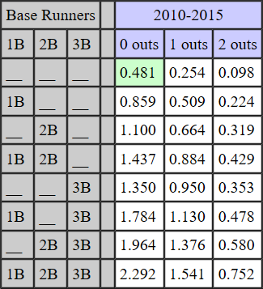

## Run Expectancy Matrix

An important concept in sabermetrics is the \textit{run expectancy matrix}. For each combination of base runners and outs, it tells us the average number of runs scored in the remainder of the inning. Here is a run expectancy table for 2010-2015.

{#id .class width=2in}

```{r setup, include=FALSE}
knitr::opts_chunk$set(echo = TRUE)
```

Note: the R code below is copied from "Analyzing Baseball Data with R" by Marchi, Albert, Baumer.

## Get the retrosheet play-by-play data

```{r, message = FALSE, warning = FALSE}
library(tidyverse)

#column names
path = "https://raw.githubusercontent.com/maxtoki/baseball_R/master/data/"
file = "fields.csv"
fields <- read_csv(file = paste(path, file, sep=""))

#I recommend cadets download this file to their computers
#it's too big to keep getting from github
# https://raw.githubusercontent.com/kfcaby/MA388_Sabermetrics/master/data/all2016.csv

data2016 <- read_csv(file = "./data/all2016.csv",
                     col_names = pull(fields, Header),
                     na = character())
```

## Runs Scored in the Remainder of the Inning

```{r}
#create some new variables
data2016 %>% 
  mutate(RUNS = AWAY_SCORE_CT + HOME_SCORE_CT,
         HALF.INNING = paste(GAME_ID, INN_CT, BAT_HOME_ID),
         RUNS.SCORED = 
           (BAT_DEST_ID > 3) + (RUN1_DEST_ID > 3) + 
           (RUN2_DEST_ID > 3) + (RUN3_DEST_ID > 3)) ->
  data2016


#compute maximum total score for each half inning
data2016 %>%
  group_by(HALF.INNING) %>%
  summarize(Outs.Inning = sum(EVENT_OUTS_CT),
            Runs.Inning = sum(RUNS.SCORED),
            Runs.Start = first(RUNS),
            MAX.RUNS = Runs.Inning + Runs.Start) -> 
  half_innings

#compute runs scored in remainder of the inning (ROI)
data2016 %>%
  inner_join(half_innings, by = "HALF.INNING") %>%
  mutate(RUNS.ROI = MAX.RUNS - RUNS) ->
  data2016
```


## Create the Run Expectancy Matrix

```{r}
#create a new variable for the current state
data2016 %>%
  mutate(BASES = 
           paste(ifelse(BASE1_RUN_ID > '',1,0),
                 ifelse(BASE2_RUN_ID > '',1,0),
                 ifelse(BASE3_RUN_ID > '',1,0), sep = ""),
         STATE = paste(BASES, OUTS_CT)) ->
  data2016

#NRUNNER1 - indicator if 1st base is occupied after the play
data2016 %>%
  mutate(NRUNNER1 =
           as.numeric(RUN1_DEST_ID==1 | BAT_DEST_ID == 1),
         NRUNNER2 = 
           as.numeric(RUN1_DEST_ID == 2 | RUN2_DEST_ID == 2 |
                        BAT_DEST_ID == 2),
         NRUNNER3 = 
           as.numeric(RUN1_DEST_ID == 3 | RUN2_DEST_ID == 3 |
                        RUN3_DEST_ID == 3 | BAT_DEST_ID == 3),
         NOUTS = OUTS_CT + EVENT_OUTS_CT,
         NEW.BASES = paste(NRUNNER1,NRUNNER2, NRUNNER3, sep = ""),
         NEW.STATE = paste(NEW.BASES, NOUTS)) ->
  data2016

#only consider plays where the runners on base, outs, or runs scored changed
data2016 %>%
  filter((STATE != NEW.STATE) | (RUNS.SCORED > 0)) ->
  data2016

#use only complete half-innings
data2016 %>%
  filter(Outs.Inning == 3) -> data2016Complete

#calculate expected number of runs scored for remainder of inning
#for each bases/outs situation
data2016Complete %>%
  group_by(STATE) %>%
  summarize(Mean = mean(RUNS.ROI)) %>%
  mutate(Outs = substr(STATE,5,5)) %>%
  arrange(Outs) -> RUNS

RUNS_out = matrix(round(RUNS$Mean,2), 8,3)
colnames(RUNS_out) = c("0 outs", "1 out", "2 outs")
rownames(RUNS_out) = c("000","001","010","011",
                       "100","101","110", "111")
```

## Print Run Expectency Matrix as a table

```{r}
library(knitr)

kable(RUNS_out)

```
