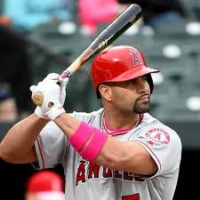

```{r setup, include=FALSE, message = FALSE, warning = FALSE}
knitr::opts_chunk$set(echo = TRUE)
```

Reference:

* ``Multilevel Modeling of OBP trajectories'' by Jim Albert. https://baseballwithr.wordpress.com/2019/11/25/multilevel-modeling-of-obp-trajectories/

Learning Objectives:

* Gain appreciation for how Bayesian statistics can help us combine prior knowledge with new observations to update our beliefs.

* Gain appreciation for how multilevel modeling can ``pool'' information to arrive a better estimates for individuals.

## Review

Let's say your goal is to predict a player's career trajectory. What are common issues that arise if you fit a quadratic model using only that player's data?

POLL

What are some ways Bayesian, multilevel models improve upon the individual trajectories?

POLL

\newpage

## Players who debuted in 2001.

Once again, we will look at players who debuted in 2001 and had at least 1000 career at bats.  These players include Albert Pujols and Ichiro Suzuki.

```{r, message= FALSE, warning = FALSE} 
library(Lahman)
library(tidyverse)
library(lubridate)
library(ggrepel)

#Players with debut in year 2000
Master %>% 
  filter(year(debut) == 2001) %>% 
  pull(playerID) -> year2001.ids

#Players with at least 1000 atbats
Batting %>% 
  filter(playerID %in% year2001.ids) %>% 
  group_by(playerID) %>% 
  summarize(AB = sum(AB)) %>% 
  filter(AB > 1000) %>% 
  pull(playerID) -> player.ids

player.ids = c(player.ids, "martijd02", "judgeaa01")

# get statistics by age and add names
source("Chapter8_functions.R")
player.ids %>% 
  map_df(get_stats) %>% 
  left_join(Master %>% select(nameLast, nameFirst, playerID))-> player.stats
```

## Trajectories from Multilevel Models

```{r, include = FALSE}
#Cummiskey
cummiskey <- data.frame(playerID = "cummiskey",
                        Age = 20:46,
                        yearID = NA,
                        SLG = NA,
                        OPS = NA,
                        AVG = NA, HR.rate = NA, 
                        OB = c(rep(NA, 20),20,110,200,NA,NA,NA,NA), 
                        PA = c(rep(NA, 20), 100,500,950, NA, NA, NA, NA),
                        nameLast = "Cummiskey",
                        nameFirst = "Kevin")
cummiskey %>% 
  mutate(OBP = OB/PA) -> cummiskey

player.stats %>% 
  rbind(cummiskey) -> player.stats

#Ashby
ashby<- data.frame(playerID = "ashby",
                        Age = 20:40,
                        yearID = NA,
                        SLG = NA,
                        OPS = NA,
                        AVG = NA, HR.rate = NA, OB = c(20,110,200, rep(NA,18)), PA = c(100,500,950,rep(NA,18)),
                        nameLast = "Ashby",
                        nameFirst = "Ashby")
ashby %>% 
  mutate(OBP = OB/PA) -> ashby

player.stats %>% 
  rbind(ashby) -> player.stats

#Chinn
chinn <- data.frame(playerID = "chinn",
                        Age = 20:40,
                        yearID = NA,
                        SLG = NA,
                        OPS = NA,
                        AVG = NA,
                    HR.rate = NA,
                    OB = c(rep(NA,7), 20,110,200, rep(NA,11)), 
                    PA = c(rep(NA,7),70,350,550,rep(NA,11)),
                        nameLast = "Chinn",
                        nameFirst = "Samantha")
chinn %>% 
  mutate(OBP = OB/PA) -> chinn

player.stats %>% 
  rbind(chinn) -> player.stats

#Efaw
efaw <- data.frame(playerID = "efaw",
                        Age = 20:40,
                        yearID = NA,
                        SLG = NA,
                        OPS = NA,
                        AVG = NA,
                    HR.rate = NA,
                    OB = c(200, 220, 210, 205,207,215,220,20,110,200, rep(NA,11)), 
                    PA = c(rep(900,7),70,350,550,rep(NA,11)),
                        nameLast = "Efaw",
                        nameFirst = "Andrew")
efaw %>% 
  mutate(OBP = OB/PA) -> efaw

player.stats %>% 
  rbind(efaw) -> player.stats

#JD
martinez <- data.frame(playerID = "martijd02",
                        Age = 31:40,
                        yearID = NA,
                        SLG = NA,
                        OPS = NA,
                        AVG = NA,
                    HR.rate = NA,
                    OB = NA,
                    PA = NA,
                        nameLast = NA,
                        nameFirst = NA)
martinez %>% 
  mutate(OBP = OB/PA) -> martinez

player.stats %>% 
  rbind(martinez) -> player.stats

#Judge

#JD
judge <- data.frame(playerID = "judgeaa01",
                        Age = 27:40,
                        yearID = NA,
                        SLG = NA,
                        OPS = NA,
                        AVG = NA,
                    HR.rate = NA,
                    OB = NA,
                    PA = NA,
                        nameLast = NA,
                        nameFirst = NA)
judge %>% 
  mutate(OBP = OB/PA) -> judge

player.stats %>% 
  rbind(judge) -> player.stats
```

Now, let's fit trajectories that pool information from all the players in the data set.

```{r, cache = TRUE, warning=FALSE, message = FALSE, results='hold'}
library(brms)  
library(rstan)
player.stats %>% 
  mutate(AgeD = Age - 30,
         Player = paste(nameFirst,nameLast, sep = " ")) -> player.stats
 
fit <- brm(OB | trials(PA) ~ AgeD + I(AgeD ^ 2) + 
             (AgeD + I(AgeD ^ 2) | Player),
           data = player.stats,
           family = binomial("logit"))

Player_Fits <- coef(fit)$Player[, "Estimate", ] %>% 
  as_tibble(rownames = "Player") %>% 
  rename(b0.hat = Intercept,
         b1.hat = AgeD,
         b2.hat = IAgeDE2)

#

# merge these estimates with our main dataset
player.stats <- inner_join(player.stats, Player_Fits, by = "Player")

# find estimates of OBP probs at each age
# note plogis is the logit function
player.stats %>% 
  mutate(OBP.pred = plogis(b0.hat + b1.hat * AgeD + b2.hat * AgeD^2)) -> player.stats
```

## Albert Pujols



```{r, fig.height=3}
player.stats %>% 
  filter(playerID == "pujolal01") %>% 
  ggplot(aes(x = Age, y = OBP)) +
  geom_point() +
  geom_smooth(method = "lm",
              formula = y ~ x + I(x^2),
              se = FALSE) +
  geom_line(aes(y = OBP.pred), color = "red") +
  labs(title = "Albert Pujols")
```

## Ichiro Suzuki


```{r, fig.height=3}
player.stats %>% 
  filter(playerID == "suzukic01") %>% 
  ggplot(aes(x = Age, y = OBP)) +
  geom_point() +
  geom_smooth(method = "lm",
              formula = y ~ x + I(x^2),
              se = FALSE) +
  geom_line(aes(y = OBP.pred), color = "red") +
  labs(title = "Ichiro Suzuki")
```

\newpage

## Okay, let's have some fun.

## Cummiskey

In my good fortune, it turns out a Red Sox scout was visiting West Point and took in a thrilling Army Math softball game.  In a sheer stroke of luck, I made a great play at third base and the Red Sox signed me to a three year contract. I retire from the Army and play three seasons in my 40s.  I put up some abysmal numbers -- the fans boo me out of Boston (``you're a real chowda-head!!'') and I retire at age 43.


```{r, fig.height=3, message = FALSE, warning = FALSE}
player.stats %>% 
  filter(playerID == "cummiskey") %>% 
  ggplot(aes(x = Age, y = OBP)) +
  geom_point() +
  geom_smooth(method = "lm",
              formula = y ~ x + I(x^2),
              se = FALSE,
              fullrange = TRUE) +
  geom_line(aes(y = OBP.pred), color = "red") +
  labs(title = "Cummiskey") + ylim(0,0.5)
```

## Ashby

On the same scouting trip, the Red Sox spot a promising young outfielder named Nick Ashby.  Nick leaves West Point and signs a contract with the Red Sox.  He plays three seasons.  In a really interesting twist of fate, he gets the exact same batting results as LTC Cummiskey, who Nick usually just refers to now as ``that Chowda-head'' at third base.

```{r, fig.height=3, message = FALSE, warning = FALSE}
player.stats %>% 
  filter(playerID == "ashby") %>% 
  ggplot(aes(x = Age, y = OBP)) +
  geom_point() +
  geom_smooth(method = "lm",
              formula = y ~ x + I(x^2),
              se = FALSE,
              fullrange = TRUE) +
  geom_line(aes(y = OBP.pred), color = "red") +
  labs(title = "Ashby") + ylim(0,0.5)
```

## Chinn

Samantha graduates from West Point and branches ___.  Unknown to even her closest friends, she installs a batting cage in her basement and takes batting practice for 4 hours a day.  After she serves her Army committment, she leaves the Army to pursue a career as in sports analytics working in the front office of the Boston Red Sox.  One day, while the team is taking batting practice, a player chides her to hit some pitches (thinking some nerdy analyst has no chance hitting the ball).  She hits five straight home runs and the Red Sox all of a sudden have a new DH.  

```{r, fig.height=3, message = FALSE, warning = FALSE}
player.stats %>% 
  filter(playerID == "chinn") %>% 
  ggplot(aes(x = Age, y = OBP)) +
  geom_point() +
  geom_smooth(method = "lm",
              formula = y ~ x + I(x^2),
              se = FALSE,
              fullrange = TRUE) +
  geom_line(aes(y = OBP.pred), color = "red") +
  labs(title = "Chinn") + ylim(0,0.5)
```


## Efaw

After being tortured for a semester by LTC Cummiskey in MA388, Andrew decides to spite him by signing a contract with the New York Yankees.  

Ok, so these models do take some tuning. 

```{r, fig.height=3, message = FALSE, warning = FALSE}
player.stats %>% 
  filter(playerID == "efaw") %>% 
  ggplot(aes(x = Age, y = OBP)) +
  geom_point() +
  geom_smooth(method = "lm",
              formula = y ~ x + I(x^2),
              se = FALSE,
              fullrange = TRUE) +
  geom_line(aes(y = OBP.pred), color = "red") +
  labs(title = "Efaw") + ylim(0,0.5)
```


## Ok, let's be serious again.

Perhaps one of the more interesting duo's in MLB is J.D. Martinez (Red Sox - Age 32) and Aaron Judge (Yankees - Age 26)

 

```{r, fig.height=3, message = FALSE, warning = FALSE}
player.stats %>% 
  filter(playerID %in% c( "martijd02", "judgeaa01")) %>% 
  ggplot(aes(x = Age, y = OBP, group = playerID)) +
  geom_point(aes(color = playerID)) +
  geom_smooth(method = "lm",
              formula = y ~ x + I(x^2),
              se = FALSE,
              fullrange = TRUE) +
  geom_line(aes(y = OBP.pred), color = "red") +
  labs(title = "Martinez and Judge") + ylim(0,0.5)
```

## These models have the effect of ``shrinking peak age" back towards the league average when there isn't much data on the player.

```{r, fig.height = 3}
# find peak ages using two models
library(broom)
models <- player.stats %>% 
  split(pull(.,playerID)) %>% 
  map(~ lm(OBP ~ I(Age - 30) + I((Age-30)^2), data = .)) %>% 
  map_df(tidy, .id = "playerID")

models %>% 
  group_by(playerID) %>% 
  summarize(A = estimate[1],
            B = estimate[2],
            C = estimate[3]) %>% 
  mutate(Peak.age = 30 - B/2/C) %>% 
  select(playerID, Peak.age) %>% 
  mutate(Type = "individual") -> beta_coefs

player.stats %>% 
  mutate(Peak.age = 30 - b1.hat/2/b2.hat,
         Type = "pooled") -> player.stats 

beta_coefs %>% 
  rbind(player.stats %>% 
          select(playerID, Peak.age, Type) %>% 
          distinct) -> peaks

ggplot(peaks, aes(x = Type, y = Peak.age)) +
  geom_point() +
  coord_flip() +
  ggtitle("Estimates of Peak Age") +
  ylim(20,40) 
```


