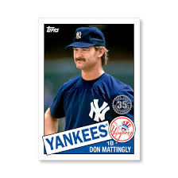

```{r setup, include=FALSE}
knitr::opts_chunk$set(echo = TRUE)
```

## Don Mattingly (``Donnie Baseball'') - Should he be in the Hall of Fame?

 

``Mattingly was arguably the best player in Major League Baseball for a six-year span from 1984-89. He averaged 27 homers and 114 RBIs, while putting up a .327/.372/.530 batting line in those six campaigns. The .530 slugging percentage led all qualified hitters, while Mattingly also paced the Majors in extra-base hits (428) and RBIs (684) during that six-year span.''

``Though he hit a respectable 222 homers, Mattingly wasn't just a power-hitting first baseman. He finished his career with a .307 average, making him one of just eight first basemen in Major League history to hit at least .305 with 200 homers. That list includes five Hall of Famers in Lou Gehrig, Jimmie Foxx, Johnny Mize, Hank Greenberg and Jim Bottomley.'' 

``Though Mattingly was one of the game's elite talents from 1984-89, he was an entirely different player starting with the '90 campaign in which he was limited to just 102 games due to a congenital disk deformity in his back. Mattingly averaged only 10 homers and 64 RBIs over his final six seasons, while hitting .286/.345/.405. He topped out at 17 homers and 86 RBIs during that stretch. Though his superb defense continued throughout his career, Mattingly ended his career by hitting .288 with seven homers and 49 RBIs over 128 games in '95.''

Excerpts from *Here's the HOF case for and against Mattingly* by Paul Casella https://www.mlb.com/news/don-mattingly-hall-of-fame-case)

### Career Statistics

```{r, message= FALSE, warning = FALSE, fig.height=3}
library(Lahman)
library(tidyverse)
library(knitr)

vars <- c("G", "AB","R", "H", "X2B","X3B",
          "HR", "RBI", "BB", "SO", "SB", "SH", "HBP", "SF")
Batting %>% 
  filter(playerID == "mattido01") %>% 
  summarise_at(vars, sum) %>% 
  mutate(AVG = round(H/AB,3)) %>% 
  select(G,AB,H,HR,AVG) %>% 
  kable(caption = "Mattingly Career Statistics")
```

### A picture's worth a thousand words.

```{r, fig.height = 3}
source("Chapter8_functions.R")
stats <- c("mattido01","baineha01") %>% map_df(get_stats)
stats %>% 
  ggplot(aes(x = Age, y = OPS, color = playerID)) +
  geom_point() +
  geom_smooth(method = "lm",
              formula = y ~ x + I(x^2), 
              se = FALSE) +
  labs(title = "Don Mattingly and Harold Baines")
```

## How does he compare to other Hall of Famers?

```{r, message = FALSE, warning=FALSE}
library(tidyverse)
library(Lahman)
library(glue)
library(plotly)
library(ggrepel)

vars <- c("G", "AB","R", "H", "X2B","X3B",
          "HR", "RBI", "BB", "SO", "SB",
          "SH", "HBP", "SF")

#Career totals for players with 5000 at bats
Batting %>% 
  group_by(playerID) %>% 
  summarize_at(vars,sum,na.rm = TRUE) %>% 
  filter(AB > 5000) %>% 
  mutate(AVG = round(H/AB,3),
         HR.rate = HR/AB,
         PA = AB + BB + SH + HBP + SF) -> career.totals

# Must have retired at least five years ago
Master %>% 
  filter(finalGame < 2014,
         finalGame > 1920) %>% 
  pull(playerID) -> eligible
career.totals %>% 
  filter(playerID %in% eligible) -> career.totals

#determine whether they are in the hall of fame
career.totals %>% 
  left_join(HallOfFame %>% 
              filter(inducted == "Y",
                     category == "Player") %>% 
              select(playerID, yearID, inducted),
            by = "playerID") %>% 
  replace_na(list(inducted = "N")) %>% 
  rename(halloffame = inducted) -> career.totals

#add full name
career.totals %>% 
  left_join(Master %>% select(nameLast, nameFirst, playerID)) %>% 
  mutate(name = paste(nameFirst,nameLast, sep = " ")) %>% 
  select(-nameLast,-nameFirst) -> career.totals


# Career Totals

p2 <- career.totals %>% 
  ggplot(aes(label = name,x = H, y = HR, color = halloffame)) +
  geom_point() +
  geom_text(data = filter(career.totals, playerID == "mattido01"),
                  aes(label = name), color = "black") +
  geom_point(data = filter(career.totals, playerID == "mattido01"),
                  aes(x = H, y = HR), color = "black") +
  labs(title = "Career Totals by Hall of Fame Status")

ggplotly(p2)
#p2
```

### A logistic regression model predecting hall of fame selection.

```{r, message = FALSE, warning = FALSE}
# Here's a model based on aggregate statistics for the probability of Hall of Fame
library(mgcv)
model.hof <- glm(halloffame == "Y" ~ H + X2B + X3B + HR + RBI + BB, 
                 family = "binomial",
                 data = career.totals)
career.totals %>% 
  mutate(hof.pred = predict(model.hof,
                            type = "response",
                            newdata = .)) -> career.totals
career.totals %>% 
  arrange(desc(hof.pred)) %>% 
  select(name, hof.pred, halloffame) %>% 
  head(10) %>% 
  kable(caption = "Top Ten Highest Predicted Probability of Hall of Fame")

career.totals %>% 
  arrange(desc(hof.pred)) %>% 
  filter(hof.pred > 0.061, hof.pred < 0.064) %>% 
  select(name, hof.pred, halloffame) %>% 
  kable(caption = "Players with similar predictions as Don Mattingly")
```


Let's compare Don Mattingly and Harold Baines. 

```{r}

# Relative Statistics

p1 <- career.totals %>% 
  ggplot(aes(label = name,x = AVG, y = HR.rate, color = halloffame)) +
  geom_point() +
  geom_text(data = filter(career.totals, playerID == "mattido01"),
                  aes(label = name), color = "black") +
  geom_point(data = filter(career.totals, playerID == "mattido01"),
                  aes(x = AVG, y = HR.rate), color = "black") +
  labs(title = "Career Totals by Hall of Fame Status")

ggplotly(p1)
#p1

career.totals %>% 
  filter(playerID %in% c("mattido01","baineha01")) %>% 
  select(name, G,PA, AB,H,HR,AVG) %>% 
  kable(caption = "Career Statistics")
```

Now, let's assume Mattingly and Baines both had 12000 plate appearances. Following the steps on page 47 of *Understanding Sabermetrics*, let's compare cumulative statistics for various kickers.

* Determine the projected number of new at bats. 

* Solve for x in $\frac{AB}{AB + BB} = \frac{AB + x}{newPA}$.  This is the number of additional at bats to award each hitter. 

```{r}
newPA = 12000
career.totals %>% 
  mutate(x = (AB/(AB + BB))*newPA - AB) -> career.totals

# x is the number of additional at bats
career.totals %>% 
  filter(playerID %in% c("mattido01","baineha01")) %>% 
  select(name, AB, x) %>% 
  kable(caption = "Number of new at bats.")
```

* Calculate the equivalence coefficient, $(1 + \frac{x}{AB} * k)$, where $k$ is the kicker. Let's investigate $k = 1, 0.95, 0.90$.

```{r}
#functin to compute equivalence coefficient
eqcoef <- function(k, d){
  d %>% 
    mutate(k = k,
           EC = 1 + x/AB * k,
           H = round(H*EC,0),
           X2B = round(X2B * EC,0),
           X3B = round(X3B * EC,0),
           HR = round(HR * EC,0),
           RBI = round(RBI * EC,0),
           BB = round(BB * EC,0)
           ) -> d
  return(d %>% select(playerID, name, k, EC, H, X2B, X3B, HR, RBI, BB))
}

k = c(1,0.95,0.9)

k %>% 
  map_df(eqcoef, d = career.totals %>% filter(playerID == "mattido01")) -> matty.ec
  
k %>%   
  map_df(eqcoef, d = career.totals %>% filter(playerID == "baineha01")) -> baine.ec

rbind(matty.ec, baine.ec) %>% 
  kable()
```

Using his projected career results, let's see how likely he would have been to make the Hall of Fame.

```{r}
matty.ec %>% 
  mutate(hof.pred = predict(model.hof,
                            type = "response",
                            newdata = .)) -> matty.ec

matty.ec %>% 
  select(name, k, hof.pred) %>% 
  kable()

#players similar at 'hypothetical mattingly'
career.totals %>% 
  filter(hof.pred > 0.60, hof.pred < 0.65) %>% 
  select(name, hof.pred, halloffame) %>% 
  kable()
```


