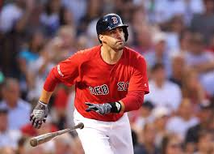
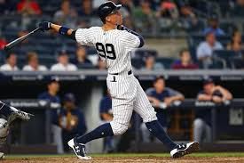
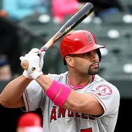

```{r setup, include=FALSE}
knitr::opts_chunk$set(echo = TRUE,
                      message = FALSE,
                      warning = FALSE,
                      fig.height = 3)
```

## Review

Let's look at J.D. Martinez and Aaron Judge.

{width=200px} {width=200px}

Here are their career statistics.

```{r, echo = FALSE, message = FALSE, warning = FALSE}
library(Lahman)
library(tidyverse)
source("Chapter8_functions.R")
library(knitr)

Master %>% 
  filter(nameLast == "Judge", nameFirst == "Aaron") %>% 
  pull(playerID) -> judge.id
Master %>% 
  filter(nameLast == "Martinez", nameFirst == "J. D.") %>% 
  pull(playerID) -> jd.id

player.ids <- c(judge.id, jd.id)

Batting %>% 
  filter(playerID %in% player.ids) %>% 
  group_by(playerID) %>% 
  summarise(HR = sum(HR),
            BB = sum(BB),
            AB = sum(AB),
            HBP = sum(HBP),
            SF = sum(SF)) %>% 
  mutate(PA = AB + BB + HBP + SF) %>% 
  left_join(Master %>% select(nameLast, nameFirst, playerID)) %>% 
  mutate(name = paste(nameFirst, nameLast, sep = " ")) %>% 
  select(name,everything(),-nameLast,-nameFirst, -HBP, -SF) -> career.totals

career.totals %>%
  kable(caption = "Career Statistics (through 2018 season)")
```

```{r, echo = FALSE, message = FALSE, warning= FALSE, fig.height=2}
player.ids %>%
  map_df(get_stats) %>% 
  left_join(Master %>% select(nameLast, nameFirst, playerID)) %>% 
  mutate(name = paste(nameFirst, nameLast, sep = " ")) -> player.stats


player.stats %>% 
  ggplot(aes(x = Age, y = HR, shape = name, color = name)) +
  geom_point() + theme_bw() + theme_classic()
```

If Aaron Judge had the same number of plate appearences ($newPA = 3765$) as J.D. Martinez, how many career home runs would Aaron Judge have with $kicker = 1.05$?

```{r, include = FALSE}
newPA = 3765
career.totals %>% 
  mutate(x = (AB/(AB + BB))*newPA - AB,
         EC = 1 + x/AB*1.05,
         AB.proj = x + AB,
         HR.proj = EC * HR)
```

\newpage

## OPS

A common statistic reported for batters is On Base Percentage Plus Slugging.  

On Base Percentage Plus Slugging = On Base Percentage (OBP) + Slugging Percentage (SLG).

On Base Percentage = $OBP = \frac{H + BB + HBP}{AB + BB + HBP + SF}$.

Slugging Percentage = $SLG = \frac{TB}{AB} = \frac{1B + 2*2B + 3*3B + 4*HR}{AB}$

### Carl Yastrzemski


Carl Yastrzemski (``Yaz'') played his entire 23 year career (1961-1983) with the Boston Red Sox.  Using the *similar* function of Chapter 8, here are six players with similar career statistics as Yaz.

```{r, message = FALSE, warning = FALSE, fig.height=3}
plot_trajectories("Carl Yastrzemski", n.similar = 6)
```

### Albert Pujols

{width=200px}

Albert Pujols has played 18 seasons (2001 - Present) with the St. Louis Cardinals and Los Angeles Angels.

### Yaz vs Pujols

Their career numbers are pretty similar.

```{r}
player.ids <- c("yastrca01","pujolal01")
Batting %>% 
  filter(playerID %in% player.ids) %>% 
  group_by(playerID) %>% 
  summarize(H = sum(H),
            AB = sum(AB),
            HR = sum(HR),
            SLG = (sum(H) - sum(X2B) - sum(X3B) - sum(HR) +
             2 * sum(X2B) + 3*sum(X3B) + 4 * sum(HR))/sum(AB),
           OBP = (sum(H) + sum(BB) + sum(HBP))/(sum(AB) + sum(BB)+ sum(HBP) + sum(SF))) %>% 
  mutate(OPS = SLG + OBP,
         AVG = H/AB) %>% 
  left_join(Master %>% select(nameLast, nameFirst, playerID)) %>% 
  mutate(name = paste(nameFirst, nameLast, sep = " ")) %>% 
  select(name,everything(),-nameLast,-nameFirst) -> player.careers

player.careers %>% 
  kable(caption = "Career Totals", digits = 3)
```

Why isn't it fair to directly compare Yaz and Pujols?

&nbsp;

```{r, echo = FALSE, fig.height = 2}
Batting %>% 
  filter(yearID > 1953) %>% 
  group_by(yearID, lgID) %>% 
  summarize(SLG.lg = (sum(H) - sum(X2B) - sum(X3B) - sum(HR) +
             2 * sum(X2B) + 3*sum(X3B) + 4 * sum(HR))/sum(AB),
           OBP.lg = (sum(H) + sum(BB) + sum(HBP))/(sum(AB) + sum(BB)+ sum(HBP) + sum(SF))) %>% 
  mutate(OPS.lg = SLG.lg + OBP.lg) -> lg.stats
           
lg.stats %>% 
  ggplot(aes(x = yearID, y = OPS.lg, color = lgID)) +
  geom_line() +
  theme_bw() +
  theme_classic()
```

### OPS+

Instead, we could use a statistic that adjusts for the overall offense in the league.  OPS+ is such a statistic.

$$OPS+ = 100 \times \left(\left(\frac{OBP_{\text{player}}}{OBP_{\text{league}}}\right) + \left(\frac{SLG_{\text{player}}}{SLG_{\text{league}}}\right) - 1\right)$$
where $OBP_{\text{league}}$ and $SLG_{\text{league}}$

Let's compare the OPS+ of Yaz and Pujols.

```{r, fig.height = 2}
#Calculate OPS
Batting %>% 
  filter(playerID %in% player.ids) %>% 
  mutate(SLG = (H - X2B - X3B - HR +
             2 * X2B + 3*X3B + 4 * HR)/AB,
           OBP = (H + BB + HBP)/(AB + BB+ HBP + SF),
           OPS = SLG + OBP,
           AVG = H/AB) %>% 
  left_join(Master %>% select(nameLast, nameFirst, playerID)) %>% 
  mutate(name = paste(nameFirst, nameLast, sep = " "))  -> yearly.stats

#join with league stats
yearly.stats %>% 
  select(name, AB, H, HR, AVG, OPS) %>% 
  head(5)

lg.stats %>% 
  head(5)

yearly.stats %>% 
  left_join(lg.stats, by = c("yearID","lgID")) -> yearly.stats

#calculate OPS+
yearly.stats %>% 
  mutate(OPS.plus = 100 * ((OBP/OBP.lg + SLG/SLG.lg) - 1)) -> yearly.stats

library(gridExtra)
p1 = yearly.stats %>% 
  ggplot(aes(x = yearID, y = OPS.plus, color = name)) +
  geom_line() + theme_bw() + theme_classic() +
  labs("OPS+") + theme(legend.position = "bottom")

p2 = yearly.stats %>% 
  ggplot(aes(x = yearID, y = OPS, color = name)) +
  geom_line() + theme_bw() + theme_classic() +
  labs("OPS") +theme(legend.position = "bottom")

grid.arrange(p1,p2, ncol = 2)
```

What are some limitations of OPS+?

&nbsp;


### Adj OPS+


